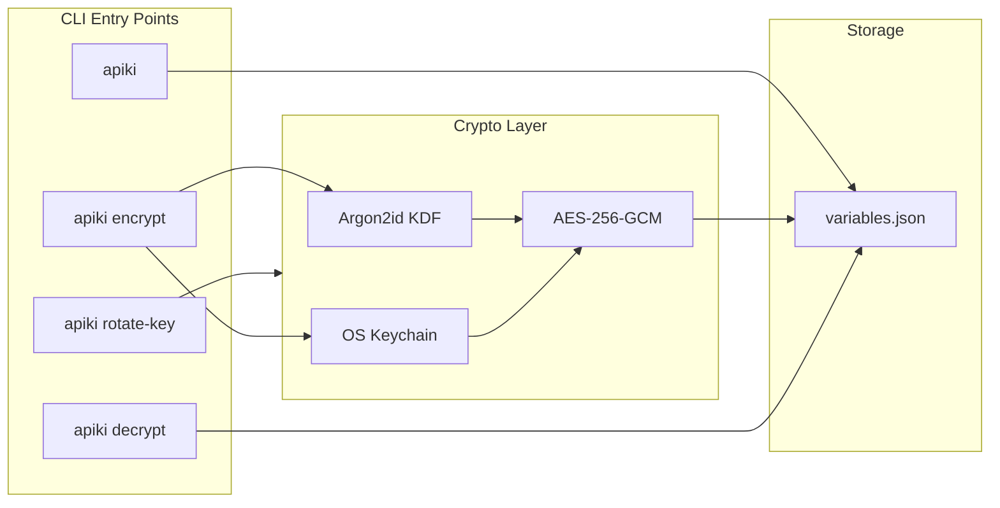
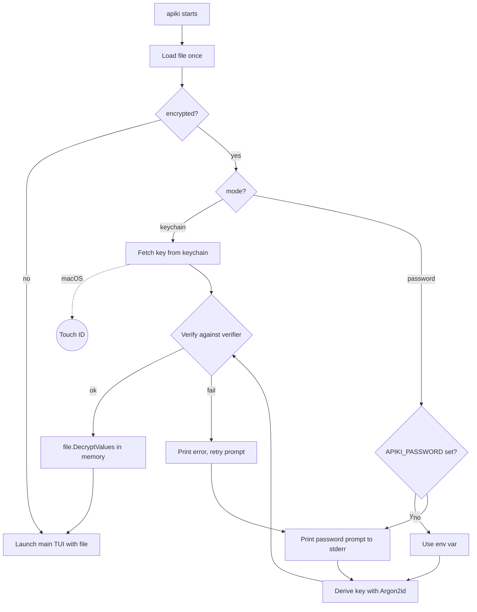

# Entry Value Encryption

## Architecture



## File Format

The `variables.json` file evolves to include an optional encryption header:

```json
{
  "encryption": {
    "mode": "password",
    "salt": "base64...",
    "verifier": "base64..."
  },
  "entries": [
    {
      "name": "DATABASE_URL",
      "value": "enc:v1:base64ciphertext...",
      "label": "Production DB"
    }
  ]
}
```

- `mode`: `"password"` or `"keychain"`
- `salt`: Random 16-byte salt for Argon2id (base64)
- `verifier`: HMAC-SHA256(derived_key, salt) for fast-fail on wrong password (base64)
- Values prefixed with `enc:v1:` contain: `nonce (12 bytes) || ciphertext || tag (16 bytes)` base64-encoded

## CLI Subcommands

Each subcommand uses simple line-by-line prompts printed to stderr. No fullscreen TUIs, no menus—just sequential questions. To preserve shell integration (`eval $(apiki)`):

- Write prompts and output to **stderr**
- Write **nothing** to stdout

| Command | Description |

| ------------------ | ---------------------------------------------------------------------------------------------------------------- |

| `apiki` | Normal TUI. If encrypted, prompts for password at startup (unless `APIKI_PASSWORD` env var set or keychain mode) |

| `apiki encrypt` | Line-by-line prompts: choose mode, enter password (with confirmation), encrypt with progress bar |

| `apiki decrypt` | Prompt for password, confirm intent, decrypt |

| `apiki rotate-key` | Prompt for current password, choose new mode, enter new password, re-encrypt |

### Prompt Flows

Simple sequential prompts. Each question prints on a new line, user types answer, next question appears.

#### `apiki encrypt`

```
$ apiki encrypt
Protection mode (password/keychain): password
Enter password: ••••••••
Confirm password: ••••••••

Encrypting 12 entries...
████████████████████░░░░░░░░ 8/12

✓ Encrypted 12 entries with password protection.
```

If passwords don't match:

```
$ apiki encrypt
Protection mode (password/keychain): password
Enter password: ••••••••
Confirm password: ••••••••
Passwords don't match. Try again.
Enter password: ••••••••
Confirm password: ••••••••

Encrypting 12 entries...
████████████████████████████ 12/12

✓ Encrypted 12 entries with password protection.
```

Keychain mode (macOS triggers Touch ID, Linux uses system keyring):

```
$ apiki encrypt
Protection mode (password/keychain): keychain

Encrypting 12 entries...
████████████████████████████ 12/12

✓ Encrypted 12 entries with keychain protection.
```

#### `apiki decrypt`

Password mode:

```
$ apiki decrypt
Enter password: ••••••••
This will remove encryption and store values in plaintext. Continue? (y/n): y

✓ Decrypted 12 entries. Values are now stored in plaintext.
```

Keychain mode (auth happens automatically):

```
$ apiki decrypt
This will remove encryption and store values in plaintext. Continue? (y/n): y

✓ Decrypted 12 entries. Values are now stored in plaintext.
```

Wrong password:

```
$ apiki decrypt
Enter password: ••••••••
Wrong password.
Enter password: ••••••••

This will remove encryption and store values in plaintext. Continue? (y/n): y

✓ Decrypted 12 entries. Values are now stored in plaintext.
```

#### `apiki rotate-key`

```
$ apiki rotate-key
Enter current password: ••••••••
New protection mode (password/keychain): password
Enter new password: ••••••••
Confirm new password: ••••••••

Re-encrypting 12 entries...
████████████████████████████ 12/12

✓ Re-encrypted 12 entries with new password.
```

### Implementation Notes

- Use `golang.org/x/term` for password input (hides characters, shows `••••••••`)
- Progress bar uses a small Bubbletea model just for the progress animation, rendered inline
- All prompts go to stderr, use `fmt.Fprintf(os.Stderr, ...)`
- Read input from stdin with `bufio.Scanner` or `term.ReadPassword`

## Key Derivation

**Password mode (Argon2id):**

- Memory: 64 MiB
- Iterations: 3
- Parallelism: 4
- Output: 32 bytes (256-bit key)

**Keychain mode:**

- Generate 32-byte random key via `crypto/rand`
- Store in OS keychain under service name `"apiki"`, account `"encryption-key"`
- **macOS**: `AccessControlUserPresence` flag triggers Touch ID (or passcode fallback)
- **Linux**: D-Bus Secret Service (GNOME Keyring, KWallet) — no biometric prompt

## Dependencies

- `golang.org/x/crypto/argon2` — Argon2id KDF
- `golang.org/x/term` — Password input (hides typed characters)
- `crypto/aes` + `crypto/cipher` — AES-256-GCM (stdlib)
- `github.com/keybase/go-keychain` — macOS Keychain (Touch ID) + Linux Secret Service

## Build Requirements

`go-keychain` requires CGO for native keychain APIs:

- **macOS**: Xcode command line tools (for Security framework)
- **Linux**: `libsecret-1-dev` (Debian/Ubuntu) or `libsecret-devel` (Fedora/RHEL)

### CI/CD Changes

Current release workflow uses single Ubuntu runner with `CGO_ENABLED=0`. With CGO:

| File | Changes |

| ----------------------------------- | ---------------------------------------------------------------- |

| `.goreleaser.yaml` | Set `CGO_ENABLED=1`, split builds by OS |

| `.github/workflows/release.yml` | Matrix strategy: macOS runner for darwin, Linux runner for linux |

GoReleaser supports `--split` and `--merge` for multi-runner builds.

## Implementation

### Package Structure

```
apiki/
├── main.go                    # Subcommand routing, launches TUI or subcommand
├── model.go                   # Main TUI model (existing)
├── ...                        # Other existing TUI files
│
├── cmd/
│   ├── encrypt/
│   │   └── encrypt.go         # apiki encrypt: prompt flow, calls crypto/entries
│   ├── decrypt/
│   │   └── decrypt.go         # apiki decrypt: prompt flow
│   └── rotate/
│       └── rotate.go          # apiki rotate-key: prompt flow
│
└── internal/
    ├── crypto/
    │   └── crypto.go          # Argon2id KDF, AES-256-GCM encrypt/decrypt
    ├── keychain/
    │   └── keychain.go        # OS keychain wrapper (go-keychain)
    ├── entries/
    │   └── entries.go         # Load/save entries, encryption metadata handling
    └── prompt/
        └── prompt.go          # Shared prompt helpers (password input, progress bar)
```

### Package Responsibilities

| Package | Responsibility |

| ------------------- | -------------------------------------------------------------------- |

| `cmd/encrypt` | Runs the encrypt prompt flow, orchestrates the full operation |

| `cmd/decrypt` | Runs the decrypt prompt flow |

| `cmd/rotate` | Runs the rotate-key prompt flow |

| `internal/crypto` | Pure crypto: `DeriveKey`, `Encrypt`, `Decrypt`, `GenerateKey` |

| `internal/keychain` | Keychain CRUD: `Store`, `Retrieve`, `Delete` |

| `internal/entries` | File I/O + in-memory model (see below) |

| `internal/prompt` | `ReadPassword`, `Confirm`, `ProgressBar` (tiny Bubbletea for bar) |

### Entries Package: I/O vs In-Memory Model

The `internal/entries` package separates file I/O from in-memory manipulation. Load once, work in memory, save once.

```go
// File represents the on-disk structure (JSON file)
type File struct {
    Encryption EncryptionHeader `json:"encryption,omitempty"`
    Entries    []Entry          `json:"entries"`
}

// EncryptionHeader holds encryption metadata.
// Zero value means unencrypted (Mode == "").
type EncryptionHeader struct {
    Mode     string `json:"mode,omitempty"`     // "" (none), "password", or "keychain"
    Salt     string `json:"salt,omitempty"`     // base64, only for password mode
    Verifier string `json:"verifier,omitempty"` // base64, only for password mode
}

// Enabled returns true if encryption is configured.
func (h EncryptionHeader) Enabled() bool {
    return h.Mode != ""
}

type Entry struct {
    Name  string `json:"name"`
    Value string `json:"value"` // plaintext or "enc:v1:..." ciphertext
    Label string `json:"label,omitempty"`
}
```

**I/O functions** — touch the filesystem exactly once per call:

```go
// Load reads the file from disk and parses it into memory
func Load(path string) (*File, error)

// Save serializes the in-memory model and writes it to disk
func Save(path string, f *File) error
```

**In-memory operations** — no I/O, just mutate the model:

```go
// EncryptValues encrypts all entry values in place using the given key
func (f *File) EncryptValues(key []byte) error

// DecryptValues decrypts all entry values in place using the given key
func (f *File) DecryptValues(key []byte) error

// Encrypted returns true if encryption is enabled (delegates to header)
func (f *File) Encrypted() bool {
    return f.Encryption.Enabled()
}

// Clone returns a deep copy of the file (for save-without-mutating-state)
func (f *File) Clone() *File
```

### Command Flow Pattern

All commands follow the same pattern: **load → prompt → transform → save**.

```
┌─────────────┐    ┌─────────────┐    ┌─────────────┐    ┌─────────────┐
│  Load file  │ →  │   Prompts   │ →  │  Transform  │ →  │  Save file  │
│  (1 read)   │    │  (collect   │    │  (in-memory │    │  (1 write)  │
│             │    │   input)    │    │   encrypt/  │    │             │
│             │    │             │    │   decrypt)  │    │             │
└─────────────┘    └─────────────┘    └─────────────┘    └─────────────┘
```

Example for `apiki encrypt`:

```go
func Run(path string) error {
    // 1. Load (single read)
    file, err := entries.Load(path)
    if err != nil { return err }

    if file.Encrypted() {
        return errors.New("already encrypted")
    }

    // 2. Prompts (no I/O to entries file)
    mode := prompt.Ask("Protection mode (password/keychain): ")
    var key []byte
    if mode == "password" {
        password := prompt.ReadPassword("Enter password: ")
        confirm := prompt.ReadPassword("Confirm password: ")
        if password != confirm {
            // retry loop...
        }
        salt := crypto.GenerateSalt()
        key = crypto.DeriveKey(password, salt)
        file.Encryption = entries.EncryptionHeader{
            Mode:     "password",
            Salt:     base64.StdEncoding.EncodeToString(salt),
            Verifier: crypto.ComputeVerifier(key, salt),
        }
    } else {
        key = crypto.GenerateKey()
        keychain.Store(key)
        file.Encryption = entries.EncryptionHeader{Mode: "keychain"}
    }

    // 3. Transform (in-memory, with progress bar)
    prompt.WithProgress(len(file.Entries), func(tick func()) {
        for i := range file.Entries {
            file.Entries[i].Value = crypto.Encrypt(key, file.Entries[i].Value)
            tick()
        }
    })

    // 4. Save (single write)
    return entries.Save(path, file)
}
```

### Modified Files

| File | Changes |

| ------------------------ | -------------------------------------------------------------------------------------- |

| [`main.go`](main.go) | Add subcommand routing, startup unlock prompt, pass `*entries.File` + key to TUI |

| [`model.go`](model.go) | Hold `*entries.File` + encryption key, update `persistEntries` to re-encrypt |

| [`entry.go`](entry.go) | Move `Entry` type and helpers to `internal/entries`, keep only TUI-specific logic |

### Main TUI Changes

The current TUI holds `entries []Entry` and calls `SaveEntries` directly. This changes to:

**Before:**

```go
type Model struct {
    entries     []Entry
    entriesPath string
    // ...
}

func (m Model) persistEntries() Model {
    apikiEntries := filterApikiEntries(m.entries)
    SaveEntries(m.entriesPath, apikiEntries)
    return m
}
```

**After:**

```go
type Model struct {
    file          *entries.File  // in-memory file model (already decrypted)
    filePath      string
    encryptionKey []byte         // nil if unencrypted, set at startup if encrypted
    // ...
}

func (m Model) persistEntries() Model {
    // Work on a copy to avoid mutating the in-memory state
    toSave := m.file.Clone()

    // Filter out .env entries (SourceFile != "")
    toSave.Entries = filterApikiEntries(toSave.Entries)

    // Re-encrypt if encryption is enabled
    if toSave.Encrypted() {
        toSave.EncryptValues(m.encryptionKey)
    }

    entries.Save(m.filePath, toSave)
    return m
}
```

The key insight: the TUI always works with **decrypted** values in memory. Encryption only happens at the I/O boundary (save). The encryption key is held in the model so we can re-encrypt on save.

**Startup flow in main.go:**

```go
func main() {
    // 1. Route subcommands
    if len(os.Args) > 1 {
        switch os.Args[1] {
        case "encrypt":
            encrypt.Run(entriesPath)
            return
        case "decrypt":
            decrypt.Run(entriesPath)
            return
        case "rotate-key":
            rotate.Run(entriesPath)
            return
        }
    }

    // 2. Load file once
    file, err := entries.Load(entriesPath)
    // handle err...

    // 3. Unlock if encrypted
    var key []byte
    if file.Encrypted() {
        key = unlockFile(file) // prompts for password or fetches from keychain
        file.DecryptValues(key)
    }

    // 4. Launch TUI with decrypted file + key
    model := NewModel(file, entriesPath, key)
    // run bubbletea...
}
```

**NewModel signature changes:**

```go
// Before
func NewModel(entries []Entry, entriesPath string) Model

// After
func NewModel(file *entries.File, filePath string, encryptionKey []byte) Model
```

The `Entry` type moves to `internal/entries`. The TUI-specific fields (`Selected`, `SourceFile`) stay as runtime-only state, either:

- Added as unexported fields in `entries.Entry` with `json:"-"` tags (current approach), or
- Wrapped in a TUI-specific struct that embeds `entries.Entry`

## Unlock Flow (Normal Startup)

When the main `apiki` command runs with an encrypted file, a simple password prompt appears before the TUI launches. The file is loaded once, decrypted in memory, then passed to the TUI.



The main TUI then holds the decrypted `*entries.File` in memory. When the user saves, values are re-encrypted (if applicable) and written to disk in a single `entries.Save` call.

Simple line prompt to stderr before TUI starts:

```
$ apiki
Enter password: ••••••••
```

On wrong password, retry inline:

```
$ apiki
Enter password: ••••••••
Wrong password.
Enter password: ••••••••
```

After successful unlock, the main TUI launches with the decrypted file in memory.