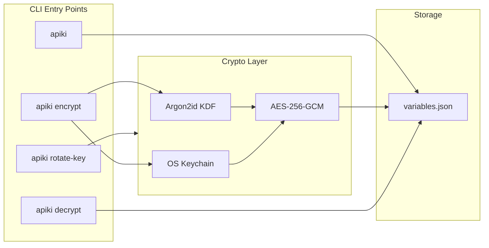
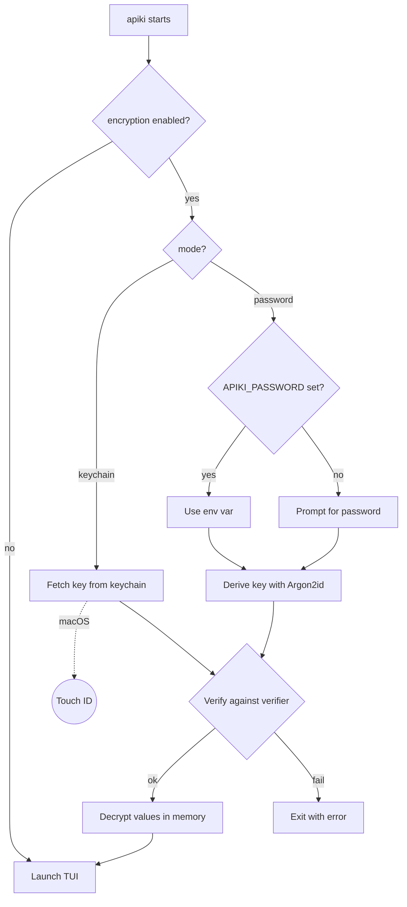

# Entry Value Encryption

## Architecture



## File Format

The `variables.json` file evolves to include an optional encryption header:

```json
{
  "encryption": {
    "mode": "password",
    "salt": "base64...",
    "verifier": "base64..."
  },
  "entries": [
    {
      "name": "DATABASE_URL",
      "value": "enc:v1:base64ciphertext...",
      "label": "Production DB"
    }
  ]
}
```

- `mode`: `"password"` or `"keychain"`
- `salt`: Random 16-byte salt for Argon2id (base64)
- `verifier`: HMAC-SHA256(derived_key, salt) for fast-fail on wrong password (base64)
- Values prefixed with `enc:v1:` contain: `nonce (12 bytes) || ciphertext || tag (16 bytes)` base64-encoded

## CLI Subcommands

All subcommands are implemented as Cobra commands. To preserve shell integration (`eval $(apiki)`), subcommands must:

- Write all user-facing output to **stderr** (messages, prompts, confirmations)
- Write **nothing** to stdout (the shell would try to eval it)

| Command | Description |

| ------------------ | ---------------------------------------------------------------------------------------------------------------- |

| `apiki` | Normal TUI. If encrypted, prompts for password at startup (unless `APIKI_PASSWORD` env var set or keychain mode) |

| `apiki encrypt` | Interactive setup: choose password vs keychain, encrypt all values |

| `apiki decrypt` | Remove encryption, restore plaintext values |

| `apiki rotate-key` | Re-encrypt with new key (can switch between password/keychain) |

## Key Derivation

**Password mode (Argon2id):**

- Memory: 64 MiB
- Iterations: 3
- Parallelism: 4
- Output: 32 bytes (256-bit key)

**Keychain mode:**

- Generate 32-byte random key via `crypto/rand`
- Store in OS keychain under service name `"apiki"`, account `"encryption-key"`
- **macOS**: `AccessControlUserPresence` flag triggers Touch ID (or passcode fallback)
- **Linux**: D-Bus Secret Service (GNOME Keyring, KWallet) — no biometric prompt

## Dependencies

- `golang.org/x/crypto/argon2` — Argon2id KDF
- `crypto/aes` + `crypto/cipher` — AES-256-GCM (stdlib)
- `github.com/keybase/go-keychain` — macOS Keychain (Touch ID) + Linux Secret Service

## Build Requirements

`go-keychain` requires CGO for native keychain APIs:

- **macOS**: Xcode command line tools (for Security framework)
- **Linux**: `libsecret-1-dev` (Debian/Ubuntu) or `libsecret-devel` (Fedora/RHEL)

### CI/CD Changes

Current release workflow uses single Ubuntu runner with `CGO_ENABLED=0`. With CGO:

| File | Changes |

| ----------------------------------- | ---------------------------------------------------------------- |

| `.goreleaser.yaml` | Set `CGO_ENABLED=1`, split builds by OS |

| `.github/workflows/release.yml` | Matrix strategy: macOS runner for darwin, Linux runner for linux |

GoReleaser supports `--split` and `--merge` for multi-runner builds.

## Implementation

### New Files

| File | Purpose |

| ------------- | -------------------------------------------------------- |

| `crypto.go` | Encryption/decryption functions, Argon2id key derivation |

| `keychain.go` | Keychain wrapper using `go-keychain` (Touch ID on macOS, Secret Service on Linux) |

| `commands.go` | Subcommand handlers (`encrypt`, `decrypt`, `rotate-key`) |

### Modified Files

| File | Changes |

| ---------------------- | -------------------------------------------------------------------------------------- |

| [`entry.go`](entry.go) | Update `LoadEntries`/`SaveEntries` to handle new JSON structure with encryption header |

| [`main.go`](main.go) | Add subcommand routing, password prompt before TUI startup |

## Unlock Flow (Normal Startup)

